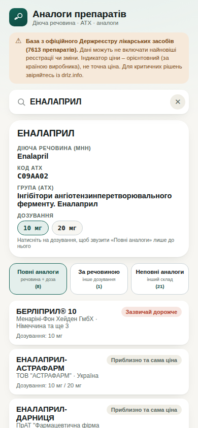

# 💊 Аналоги препаратів

Вебзастосунок для фармацевтів: введіть торгову назву препарату – одразу побачите діючу речовину, код АТХ, фармгрупу та перелік аналогів у трьох категоріях – за дозуванням, за діючою речовиною та неповних – із виробником, країною та орієнтовним рівнем ціни.

Працює у браузері, встановлюється на телефон як звичайний застосунок (Android/iOS/десктоп) і не потребує інтернету після першого відкриття.



## Можливості

- Пошук за торговою назвою з випадаючою підказкою – набір починається, варіанти з'являються одразу
- Автоматичне заповнення діючої речовини (МНН), коду АТХ, фармакотерапевтичної групи та списку доступних дозувань
- Якщо в препарату кілька зареєстрованих дозувань – можна клікнути на конкретне, і вкладка «Повні аналоги» звузиться лише до нього (решта аналогів автоматично переїдуть у «За речовиною»); повторний клік знімає вибір
- Три окремі вкладки: **«Повні аналоги»** (та сама речовина і те саме дозування), **«За речовиною»** (та сама речовина, інше дозування) і **«Неповні аналоги»** (спільна речовина, але інший склад)
- Для кожного аналога – виробник, країна, дозування та мітка «зазвичай дешевше / приблизно та сама ціна / зазвичай дорожче»
- Коректна обробка комбінованих засобів (наприклад рослинних чи гомеопатичних препаратів із кількома діючими речовинами) – такі препарати ніколи не подаються як «повний аналог» одне одному лише через збіг широкого коду АТХ
- Адаптивний дизайн – однаково добре виглядає на телефоні, планшеті й комп'ютері
- Встановлюється на головний екран телефону (Android і iOS) і працює офлайн
- Жодних сторонніх сервісів чи збору даних – усі розрахунки й пошук відбуваються локально, на пристрої користувача

## Джерело даних

База побудована на основі офіційного **Державного реєстру лікарських засобів України** (Міністерство охорони здоров'я / ДЕЦ). Дані можуть не включати найновіші реєстрації чи зміни – перед ухваленням критичних рішень звіряйтеся з живим реєстром на [drlz.info](https://drlz.info).

Індикатор ціни – орієнтовний показник (за типовим ціновим рівнем країни виробника), а не точна ціна.

## Логіка визначення аналогів

```
Повні аналоги   = той самий код АТХ (5-й рівень), обидва препарати мають
                   точно визначений склад (не комбінований засіб),
                   і дозування збігається – або з будь-яким із дозувань
                   шуканого препарату (типова поведінка), або лише з
                   конкретним дозуванням, якщо користувач його обрав
                   кліком

За речовиною    = той самий код АТХ і точно визначений склад,
                   але дозування інше (або не вказане в реєстрі)

Неповні аналоги = спільна «коренева» діюча речовина, але інший код АТХ
                   (наприклад інша комбінація) –
                   АБО той самий код АТХ, але хоча б один із препаратів
                   є комбінованим засобом без точно визначеного складу
                   (тоді повний аналог гарантувати не можна)
```

Дозування витягується з поля «Склад» офіційного реєстру автоматично. Для рідких і ін'єкційних форм (розчини, сиропи, суспензії), де число в складі означає концентрацію на 1 мл, а не разову дозу, порівняння дозування свідомо не виконується – такі препарати потрапляють у категорію «За речовиною» з поміткою, що дозування не вказано.

## Встановлення на телефон

**Android (Chrome):** відкрити посилання → меню (⋮) → «Додати на головний екран» / «Встановити застосунок»

**iOS (Safari):** відкрити посилання → кнопка «Поділитися» → «На екран Home»

## Технології

Один файл `index.html` – чистий HTML, CSS та JavaScript, без збірки, без залежностей і фреймворків. База препаратів вбудована прямо у файл (JSON), тому пошук і зіставлення аналогів працюють миттєво й повністю офлайн.

## Ліцензія

Проєкт поширюється за ліцензією **MIT** – див. файл [LICENSE](LICENSE). Це означає, що його можна вільно використовувати, копіювати, змінювати й поширювати, зокрема й для комерційних цілей, за умови збереження посилання на авторство.

Дані Державного реєстру лікарських засобів України є відкритими даними й поширюються окремо від коду застосунку.

## Автор

**Любомир Гаврищук**
